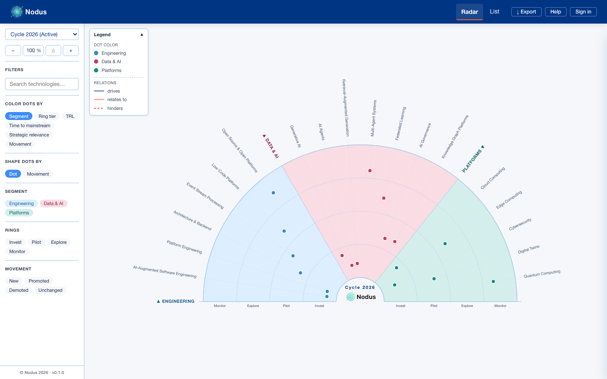
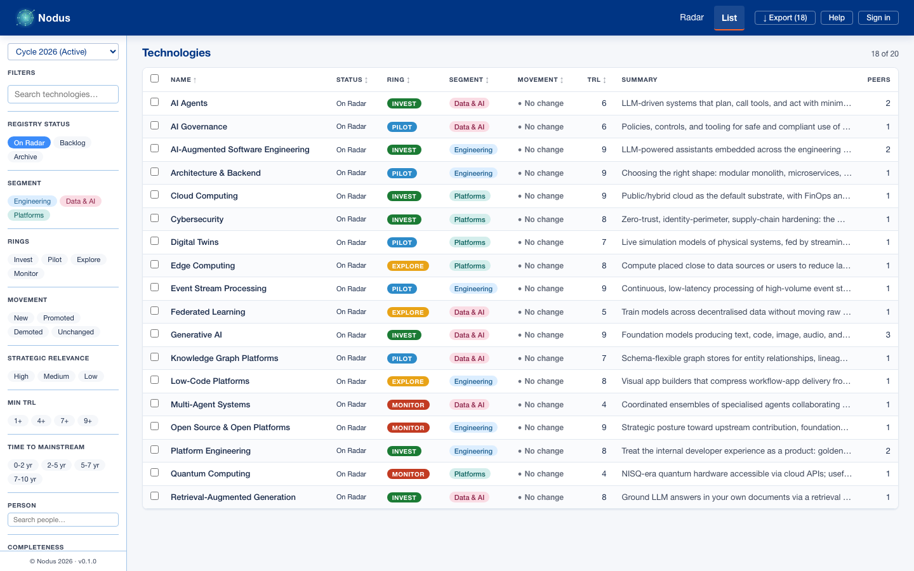
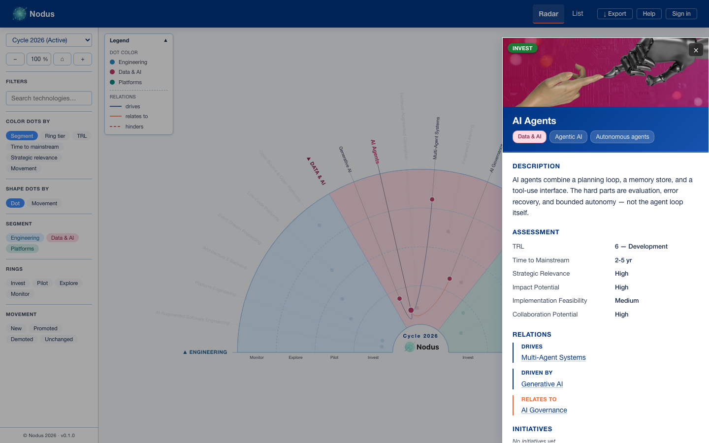

<p align="center">
  <picture>
    <source media="(prefers-color-scheme: dark)" srcset="assets/nodus_logo_text_tight_dark.svg">
    
  </picture>
</p>

# Nodus

A self-hosted **Technology Radar** webapp. Curate technologies into rings (Invest / Pilot / Explore / Monitor) and segments, track movement across cycles, attach peer references and people, and export the result for stakeholder communication.

Nodus is for teams who have outgrown a spreadsheet of "things we're watching" but don't want a third-party SaaS to own their scouting data. You get the ThoughtWorks-style visual radar, plus a structured catalog (factsheets, immutable assessments, peer references, people), role-based access, and reproducible exports — all running on your own infrastructure.



## Features

### Radar visualization
- **Interactive D3 radar** with four configurable rings and any number of segments
- **Focus mode** — click a wedge to zoom in on one segment
- **Color encoding** — switch between segment-colored and ring-colored dots
- **Shape encoding** — dots, squares, triangles to encode movement (new / promoted / demoted) at a glance
- **Cycle-aware movement indicators** computed from `MovementEvent` history
- **Center logo** — defaults to the Nodus mark; admins can swap in a custom organisation logo

### Catalog management
- **Topics, Technologies, Factsheets, Assessments** as a v2 data model with strict FK enforcement
- **Aliases** with case- and punctuation-insensitive matching for de-duplication
- **Peer references** — link each topic to how peer organisations classify it, with multiple source URLs per peer
- **People** — link domain experts and contacts to topics with role chips (Owner, Contact, Champion)
- **Relations** — typed directed edges between topics (`drives`, `driven_by`, `hinders`, `hindered_by`, `relates_to`)
- **Cycles** — review-period containers; one open cycle at a time, history preserved for snapshots
- **Strategic Innovation Fields** — optional cross-segment grouping for portfolio reporting

### Authentication & roles
- **Four roles** — PublicReader, Reader, Writer, Admin — gated at the route level
- **Local accounts** with bcrypt-hashed passwords and TOTP MFA (optional)
- **Entra ID (Azure AD) SSO** — OIDC authorization-code + PKCE, JIT user provisioning, group-to-role mapping
- **API keys** — long-lived tokens for service automation, scoped per user
- **Forced password rotation** on first login for operator-created accounts
- **Bootstrap CLI** — `app.cli create-admin` for the first admin on a new deployment (works over `az containerapp exec`)

### Privacy & visibility
- **Per-field visibility config** — operator-controlled redaction of PII fields (email, phone) for non-Writer callers
- **`not_for_external_publication` flag** on topics — hides specific topics from anonymous and PublicReader callers
- **Deliverable parity** — every cycle snapshot honours the same visibility perimeter as the live radar

### Import & export
- **Backup / restore** — full DB + media as a single zip (optional AES-256-GCM envelope)
- **Peer-reference import** — paste another Nodus instance's exported JSON and merge selectively
- **Deliverables** — radar snapshot JSON per cycle, plus per-row CSV / XLSX with curated columns
- **PDF / SVG export** — print-ready radar with optional cycle label and watermark



## Architecture

```
src/
  backend/                 FastAPI + SQLModel
    app/
      main.py              FastAPI app, lifespan (DB init, settings seed, demo users in dev)
      cli.py               Operator CLI (db init/reset, seed, backfill, create-admin)
      config.py            All NODUS_* env-var resolution
      db.py                Engine, FK pragma, schema bootstrap
      auth.py              Local sessions, bcrypt, TOTP, API keys, role gating
      auth_entra.py        Entra ID / OIDC discovery, JWKS, JIT provisioning
      models/              SQLModel tables (Topic, Technology, Cycle, Relation, …)
      routers/             FastAPI routers (one per resource)
      schemas/             Pydantic read/write schemas
      services/            Visibility, deduplication, peer-import, deliverables, backup
      seed/
        dummy.py           Bundled 20-topic dummy dataset (idempotent)
        importer.py        Hero-image relink + demo-movement helpers
      scripts/
        create_user.py     Underlying user-creation helper (called by create-admin)
    tests/                 pytest suite, 477 tests, in-memory SQLite per test

  frontend/                React 19 + Vite + TypeScript
    src/
      App.tsx              Router + auth context
      radar/               RadarPage, RadarView (D3 SVG), filters, list view, exports
      manage/              Admin pages — segments, cycles, topics, persons, users, settings,
                           visibility, peer-import, backup, API keys
      shared/              Layout, design-system primitives (Button, Modal, Badge, …)
      topic-detail/        Per-topic modal — factsheet, assessments, peer refs, people
      styles/              tokens.css (Nodus brand tokens), global.css
      api/                 openapi-typescript generated bindings + per-resource clients
    tests/                 vitest unit/component tests + Playwright e2e
```

See [`docs/methodology.md`](docs/methodology.md) for the underlying tech-radar methodology and [`docs/auth.md`](docs/auth.md) for the auth/role model.

## Setup

### Prerequisites
- **Python 3.14+** with [`uv`](https://github.com/astral-sh/uv) — install via `curl -LsSf https://astral.sh/uv/install.sh | sh` (or your package manager). `uv` will fetch a matching Python toolchain automatically if your system doesn't have one.
- **Node.js 20+** and **npm 9+** — install via [nvm](https://github.com/nvm-sh/nvm), [fnm](https://github.com/Schniz/fnm), or [nodejs.org](https://nodejs.org/)
- **GNU Make** — preinstalled on macOS / most Linux distros; on Windows use WSL or `choco install make`
- **pre-commit** (optional but recommended) — `uv tool install pre-commit`, then `pre-commit install` after cloning

### Backend
```bash
cd src/backend
uv sync
```

### Frontend
```bash
cd src/frontend
npm install
```

### Environment
Copy `src/backend/.env.example` to `src/backend/.env` and adjust. Every `NODUS_*` variable is optional — leave a line out (or set it empty) to get the documented default.

Key variables:

| Variable | Description |
|----------|-------------|
| `NODUS_ENV` | `dev` / `test` / `prod` — gates demo-user seeding and similar |
| `NODUS_DATABASE_URL` | SQLAlchemy URL (omit for built-in SQLite at `src/backend/radar.db`) |
| `NODUS_AUTH_DISABLED` | `1` to short-circuit auth (synthetic admin) — never use in production |
| `NODUS_AUTH_ENTRA_TENANT_ID` | Azure tenant ID for SSO |
| `NODUS_AUTH_ENTRA_CLIENT_ID` | App registration client ID |
| `NODUS_AUTH_ENTRA_CLIENT_SECRET` | App registration secret |
| `NODUS_AUTH_ENTRA_GROUP_ADMIN` | Azure AD group whose members get the Admin role on first login |
| `NODUS_AUTH_ENTRA_GROUP_WRITER` | Group → Writer role |
| `NODUS_AUTH_ENTRA_GROUP_READER` | Group → Reader role |
| `NODUS_DOCS_DISABLED` | `1` to hide Swagger / ReDoc in production |
| `NODUS_DOCS_PASSWORD` | HTTP-Basic password for the docs endpoints |
| `NODUS_CORS_ORIGINS` | Comma-separated allow-list (defaults to `http://localhost:5173`) |

See [`src/backend/README.md`](src/backend/README.md) for the full list and Postgres deployment notes.

## Running locally

```bash
# Show all targets
make

# Backend (FastAPI on :8000)
make backend

# Frontend (Vite dev server on :5173)
make frontend

# Populate the DB with the bundled dummy dataset
make seed-dummy

# All tests (backend pytest + frontend vitest)
make test
```

Open <http://localhost:5173> in the browser. The frontend proxies API calls to the backend at <http://localhost:8000>.



## Running with Docker

For a containerised local stack (backend + nginx-served frontend) or to build the single-container production image:

```bash
# Local dev — two services via docker-compose
cp .env.example .env
docker compose up --build      # frontend on :3000, backend on :8000

# Production — one image bundling frontend + backend
docker build -t nodus:latest .
docker run --rm -p 8000:8000 --env-file .env nodus:latest
```

Full reference (multi-stage layout, `.dockerignore` scoping, volume persistence, base-image versions) in [`docs/docker.md`](docs/docker.md).

## First admin on a new deployment

A fresh deployment has no users. Either configure Entra ID SSO (the first user in the admin group auto-provisions on login) or create a local admin via CLI:

```bash
# Local
cd src/backend && uv run python -m app.cli create-admin --username admin

# Azure Container Apps
az containerapp exec --name nodus-backend --resource-group <rg>
# then inside the container:
uv run python -m app.cli create-admin --username admin
```

The command prompts for the password via stdin; it never appears in argv, env vars, or shell history. See [`src/backend/README.md`](src/backend/README.md#bootstrapping-the-first-admin) for details.

## Tooling

- **Pre-commit hooks** — 16 hooks covering ruff (lint + format), mypy, ESLint, Prettier, tsc, gitleaks (secret scanning), and the usual hygiene checks. Run `pre-commit install` once, then they fire on every commit.
- **`make test`** — runs `pytest` in the backend and `vitest` in the frontend. `make test-e2e` runs Playwright (needs the dev server).
- **VS Code workspace config** in `.vscode/` — autoselects the right interpreter, runs Ruff/mypy from the project venv, and recommends the five extensions the workspace expects.

## Documentation

**Methodology and assessment** (`docs/`)

- [`methodology.md`](docs/methodology.md) — the tech-radar methodology Nodus implements
- [`assessment-criteria.md`](docs/assessment-criteria.md) — six scoring criteria, scales, and rubrics
- [`assessment-workflow.md`](docs/assessment-workflow.md) — end-to-end operator walkthrough (capture → score → place → publish)
- [`ring-placement.md`](docs/ring-placement.md) — Invest / Pilot / Explore / Monitor decision guide
- [`assessment-api.md`](docs/assessment-api.md) — assessment API payload reference

**Operations** (`docs/`)

- [`auth.md`](docs/auth.md) — authentication modes, roles, and Entra ID SSO
- [`api-docs-deployment.md`](docs/api-docs-deployment.md) — Swagger UI / ReDoc configuration
- [`deployment.md`](docs/deployment.md) — deployment checklist and operations guide
- [`docker.md`](docs/docker.md) — Dockerfiles, docker-compose, and the bundled single-container image

**Per-module setup**

- [`src/backend/README.md`](src/backend/README.md) — backend setup, env vars, CLI commands
- [`src/frontend/README.md`](src/frontend/README.md) — frontend setup and scripts

**Project meta**

- [`CONVENTIONS.md`](CONVENTIONS.md) — code and AI-agent conventions
- [`CONTRIBUTING.md`](CONTRIBUTING.md) — how to contribute
- [`ARCHITECTURE.md`](ARCHITECTURE.md) — high-level architecture
- [`ONBOARDING.md`](ONBOARDING.md) — first-30-minutes guide

## Versioning

Nodus follows [Semantic Versioning](https://semver.org/). The
[`VERSION`](VERSION) file at the repo root is the single canonical
source — every other consumer reads from it:

| Consumer | How it reads `VERSION` |
|---|---|
| Backend wheel | `pyproject.toml` uses `dynamic = ["version"]` + Hatch's regex source. |
| Backend runtime (`/api/health`, FastAPI schema, startup log) | `importlib.metadata.version("nodus-backend")` (set at install time from the line above), with a file-fallback for un-installed runs. |
| Frontend bundle (footer, `__APP_VERSION__`) | `vite.config.ts` reads `VERSION` at build time. |
| Docker images | `--build-arg APP_VERSION=$(cat VERSION)` feeds the OCI `org.opencontainers.image.version` label and writes a VERSION file inside the image so the backend's runtime fallback resolves. |
| `package.json` `version` field | Kept for npm/tooling compatibility and synced by the bump script (no code reads it). |

Bump and tag with the Makefile targets:

```bash
make bump VERSION=0.2.0      # writes VERSION, syncs package.json + lockfiles
make release VERSION=0.2.0   # bump + commit + tag v0.2.0
git push --follow-tags

make docker-build            # builds nodus:$(cat VERSION) and nodus:latest
```

## License

This project is licensed under the Apache License, Version 2.0 — see [LICENSE](LICENSE) for the full text.


## FAQ

**Why was this app built?**

For visualization of innovations at TenneT we wanted a tech radar, similar to commercial tools like [Itonics](https://www.itonics-innovation.com/) and others. For this Nodus was built, which is open source and free to use by all.

**Was this application [vibe-coded](https://en.wikipedia.org/wiki/Vibe_coding)?**

Yes, the structure was created using agentic workflows — but only after we had built up a workflow around them. It still took about 80 hours to get it to a sturdy and workable application.\
